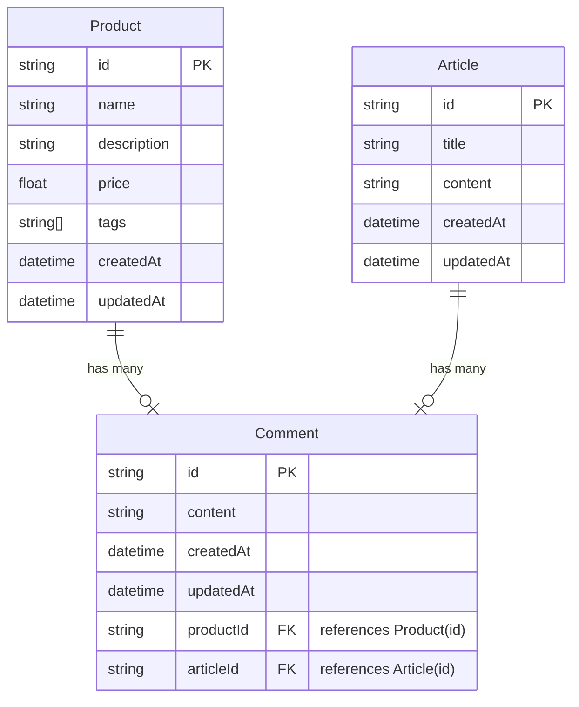

# 2-sprint-mission

```mermaid
erDiagram
    Product {
        string id PK
        string name
        string description
        float price
        string[] tags
        datetime createdAt
        datetime updatedAt
    }

    Article {
        string id PK
        string title
        string content
        datetime createdAt
        datetime updatedAt
    }

    Comment {
        string id PK
        string content
        datetime createdAt
        datetime updatedAt
        string productId FK "references Product(id)"
        string articleId FK "references Article(id)"
    }

    Product ||--o| Comment: "has many"
    Article ||--o| Comment: "has many"
```
