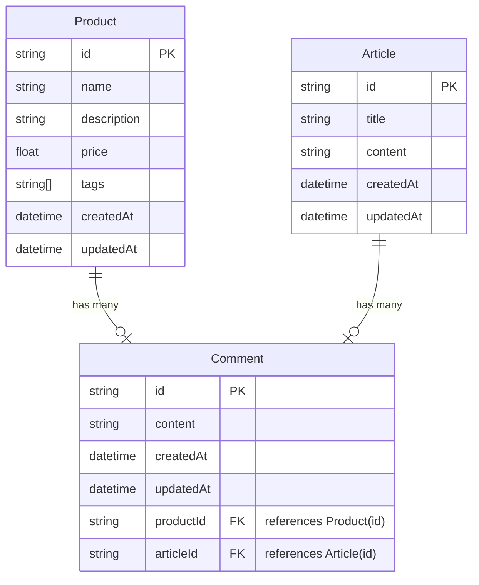

## Sprint Mission 3 API Integration

본 프로젝트는 Sprint Mission 3 요구사항을 바탕으로 상품 및 게시글, 댓글 데이터를 가져오고 조작하는 기능을 구현합니다.

## 프로젝트 구조

```
📦 프로젝트 루트
 ┣ 📂 prisma                  # Prisma 관련 파일
 ┣ 📂 src                     # 애플리케이션 소스 코드
 ┃ ┣ 📜 app.js                # 애플리케이션 실행 및 기능 실행 코드
 ┃ ┣ 📜 struct.js             # 유효성 검증 및 구조 정의
 ┃ ┣ 📂 routes                # 라우터 관련 파일
 ┃ ┃ ┣ 📜 productRoute.js     # Product API 라우터
 ┃ ┃ ┣ 📜 articleRoute.js     # Article API 라우터
 ┃ ┃ ┣ 📜 commentRoute.js     # Comment API 라우터
 ┃ ┣ 📂 uploads               # 이미지 업로드 및 관련 파일
 ┃ ┣ 📂 utils                 # 유틸리티 함수들
 ┃ ┃ ┣ 📜 asyncHandler.js     # 비동기 함수 에러 처리 핸들러
 ┣ 📜 .env                    # 환경 변수 설정
```

## 커밋 컨벤션

| 커밋     | 역할                                                                  |
| -------- | --------------------------------------------------------------------- |
| Feat     | 기능 구현과 관련된 커밋                                               |
| Fix      | 버그를 고친 경우                                                      |
| Refactor | 더 좋은 코드로 개선한 경우 (기능에 변화가 없는 경우) ex-코드리뷰 반영 |
| Docs     | README.md 등 문서를 작성한 경우                                       |
| Chore    | 주석 추가, 자잘한 문서 수정                                           |

## 기술 스택

| 역할                 | 종류                                                                                                                                                                                                              |
| -------------------- | ----------------------------------------------------------------------------------------------------------------------------------------------------------------------------------------------------------------- |
| Programming Language |                                                                                       |
| JavaScript Runtime   |                                                                                                            |
| Package Manager      |                                                                                                                |
| ORM                  |                                                                                                              |
| Database             |                                                                                                  |
| Formatting           |   |
| Version Control      |    |

## 데이터베이스 모델


