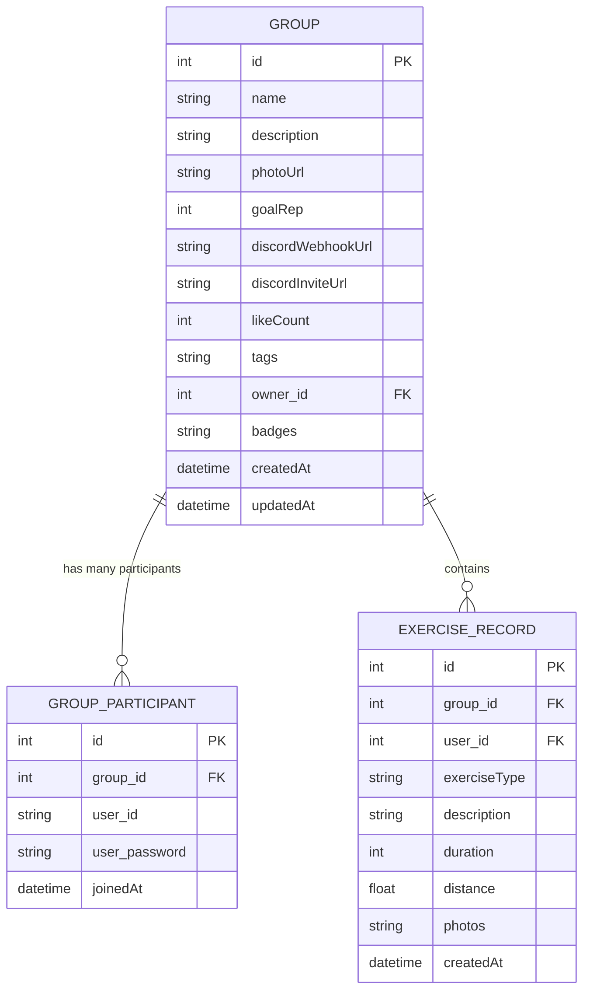

```mermaid
erDiagram
    GROUP {
        int id PK
        string name
        string description
        string photoUrl
        int goalRep
        string discordWebhookUrl
        string discordInviteUrl
        int likeCount
        string tags
        int owner_id FK
        string badges
        datetime createdAt
        datetime updatedAt
        %% UNIQUE(name)
        %% DEFAULT goalRep = 0
        %% DEFAULT likeCount = 0
        %% DEFAULT createdAt = NOW()
        %% DEFAULT updatedAt = NOW()
        %% REFERENCES owner_id -> USER(id)
    }

    GROUP_PARTICIPANT {
        int id PK
        int group_id FK
        string user_id
        string user_password
        datetime joinedAt
        %% UNIQUE(group_id, user_id)
        %% DEFAULT joinedAt = NOW()
        %% REFERENCES group_id -> GROUP(id)
    }

    EXERCISE_RECORD {
        int id PK
        int group_id FK
        int user_id FK
        string exerciseType
        string description
        int duration
        float distance
        string photos
        datetime createdAt
        %% DEFAULT createdAt = NOW()
        %% REFERENCES group_id -> GROUP(id)
        %% REFERENCES user_id -> USER(id)
    }

    GROUP ||--o{ GROUP_PARTICIPANT : "has many participants"
    GROUP ||--o{ EXERCISE_RECORD : "contains"
```
